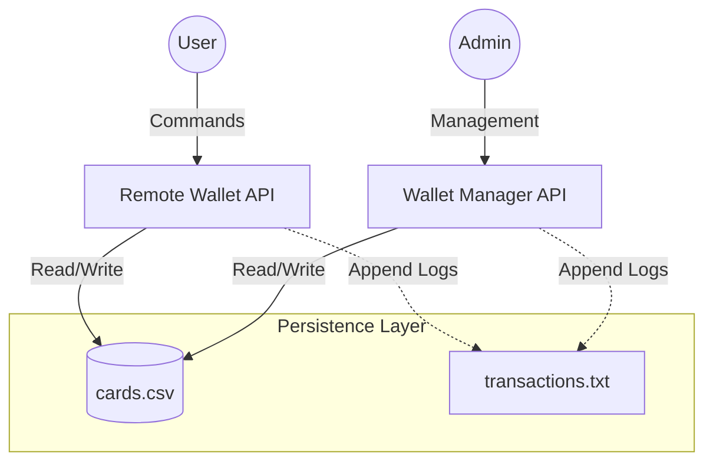

# 💳 Electronic Wallet System


A robust, console-based electronic wallet system implemented in **C++17**. This project demonstrates **systems engineering principles** by simulating a distributed financial environment where two distinct processes (Admin & Client) operate concurrently on a shared persistent state.

---

## 🏗️ System Architecture

The system mimics a real-world distributed application where an administrative backend and a user-facing frontend share a synchronized data source.



---

## ✨ Key Features

### 🏢 Wallet Manager (`wallet_manager`)
* **Card Issuance**: Create new cards with owner details, expiration dates, and unique card numbers.
* **Fund Management**: Load money directly onto existing cards.
* **Persistence**: Automatically saves all card data to `cards.csv` to ensure data retention between sessions.
* **System Overview**: List and inspect all issued cards within the system.

### 🏧 Remote Wallet (`remote_wallet`)
* **Transaction Processing**: Simulate spending money at a point-of-sale.
* **P2P Transfers**: Securely transfer funds between two distinct cards.
* **Robust Input Sanitization**: Prevents data corruption via strict type checking and negative value rejection.
* **Activity Logging**: Every action (Transfer, Load, Spend) is timestamped and recorded in `transactions.txt`.

---

## 🛠️ Technical Implementation

* **Language**: C++17 (utilizing STL containers, streams, and exception handling)
* **Architecture**: Decoupled processes interacting via shared file storage.
* **Data Storage**: Custom CSV parser/serializer for lightweight persistence.
* **Safety**: Implements `try-catch` blocks for robust error handling against malformed inputs.

---

## 🚀 Getting Started

### 1. Prerequisites
* **Compiler**: GCC/G++ supporting C++17.
* **OS**: Windows, Linux, or macOS.

### 2. Compilation

**For Windows Users:**
Run the batch file to build both executables in the `bin/` directory:
```bash
.\build.bat
```

**For Linux/Unix Users:**
Use the makefile to build the project:
```bash
make
```

### 3. Usage

**Important:** Run all commands from the **project root directory** so the executables can locate `cards.csv`.

#### 🔧 Wallet Manager (Admin)
```bash
# Add a new card
./bin/wallet_manager.exe add_card "Visa" "1001" "John Doe" "12/28"

# Load money onto a card
./bin/wallet_manager.exe load_money "1001" 500.00

# List all cards
./bin/wallet_manager.exe list_cards
```

#### 💸 Remote Wallet (User)
```bash
# Spend money from a card
./bin/remote_wallet.exe spend "1001" 25.50

# Transfer money between cards
./bin/remote_wallet.exe transfer "1001" "2002" 100.00

# View card details
./bin/remote_wallet.exe view_card "1001"
```

---

## 📂 Project Structure

```bash
l4aaa-electronic_wallet_system/
├── bin/                 # Compiled executables
├── include/             # Header files (Card.h, Wallet.h, etc.)
├── src/                 # Source code (Implementation logic)
├── cards.csv            # Persistent card database
├── transactions.txt     # Transaction history log
├── build.bat            # Windows build script
├── makefile             # Linux build script
└── README.md            # Documentation
```

---

## 📝 License

Distributed under the MIT License. See `LICENSE` for more information.